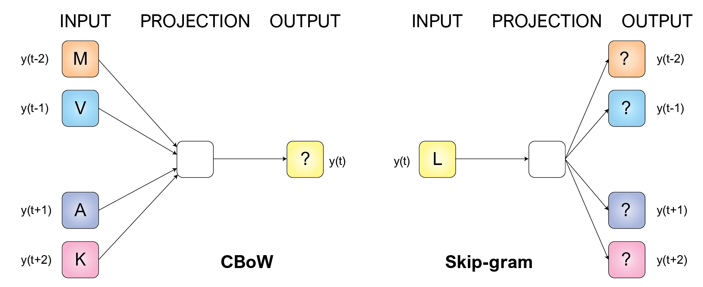

# Predicting the language of life
Language of life essentially refers all of the information that is encoded by our genetic sequences, and we propose to view these sequences as the sentences that makes up the vocabulary of life. The language of life is built by protein sequences, and the biological alphabet consists of 21 amino acids denoted by their designated [letters](https://en.wikipedia.org/wiki/Amino_acid#Table_of_standard_amino_acid_abbreviations_and_properties).

This project aims to predict amino acids in a protein sequence, where two word embedding architectures are used: Continuous Bag-of-Words and  Skip-gram. The models are implemented in Pytorch and the archicture can be seen in the figure below.

**All the results can be seen in this [notebook](..).**



## Continuous  Bag-of-Words (CBoW)
The goal of CBoW is to predict a amino acid at a position t given the surrounding words (contexts), meaning that we try to optimize the probabilities of each amino acid at position t. [1]

To run the CBOW model in a terminal, write
```console
python CBoWscripts/main_CBoW_aa.py -train_data TRAIN_DATA -val_data VAL_DATA [OPTIONAL FLAGS]
```
The CBoW model has been implemented to run through command line with the following flags used in the run below: 
- `-train_data TRAIN_DATA`: Path to training data.
- `-val_data VAL_DATA`: Path to validation data.
- `-direction {before,after,both}`: Direction of window, which can be `before`, `after` or `both` for the models $p\left(y_t|y_{t-c}\right)$, $p\left(y_t|y_{t+c}\right)$ and $p\left(y_t|y_{t-c}^{t+c}\right)$, respectively. 
- `-padding`: Whether to use padding on not.
- `-window_size WINDOW_SIZE`: Size of the context window.
- `-batch_size BATCH_SIZE`: Size of neural network batches.
- `-learning_rate LEARNING_RATE`: Learning rate for neural network.
- `-f POST_FIX`Post_fix for output files. 
- `-epochs EPOCHS`: Number of epochs.
- `-embed_dim EMBEDDING_DIM`: Number of embedding dimensions.
- `-resume RESUME`: Filename for saved checkpoint.
- `-wkdir WKDIR`: Path to directory for output files. 

## Skip-gram
Instead of predicting the amino acid at the center, the Skip-gram model instead optimizes the prediction of the context words given a center word at position t. [1, 2]

To run the Skip-gram model in a terminal, use
```console
python main_sg.py --window 1 --direction both --epochs 10 --optimizer SGD --embeddingdim 2 -lr 1e-2 --save
```

You can specify the following arguments for running the Skip-gram model:
- `--datadir DATADIR`: data directory
- `--traindata TRAINDATA`: name for training data file
- `--testdata TESTDATA`: name for test data file
- `--validdata VALIDDATA`: name for validation data file
- `--window WINDOW`: number of surrounding words (context size)
- `--direction {forward,backward,both}`: specifies whether the words forward, backward or both
- `--embeddingdim EMBEDDINGDIM`: number of embedding dimensions
- `-lr LR`: learning rate
- `--batchsize BATCHSIZE`: size of batches
- `--epochs EPOCHS`: how many iterations the network should be trained in
- `--subsampling`: whether or not the data should be subsampled
- `--logevery LOGEVERY`: how often during training should results be printed out
- `--optimizer {Adam,SGD}`: which optimizer should be used: Adam or Stochastic Graident Descent (SGD)
- `--testnetwork`: boolean, should the network be tested on the training data?
- `--tSNE`: boolean, should tSNE plot be created?
- `--save`: boolean, save model each epoch

### Testing the networks
Instead of testing the Skip-gram network together with the training loop, one can also use
```console
python test_network_sg.py --model MODEL --tSNE
``` 

Arguments for `test_network_sg.py` are:
- `--datadir DATADIR`: data directory
- `--traindata TRAINDATA`: name for training data file
- `--testdata TESTDATA`: name for test data file
- `--model MODEL`: Path + name to saved model
- `--batchsize BATCHSIZE`: size of batches
- `--tSNE`: if specified, creates tSNE plot

Testing the CBoW network is done by running the below script in terminal
```console
python test_cbow.py -model MODEL -test_data TEST_DATA [OPTIONAL FLAGS]
```

The optional flags for testing this model are: 
- `-direction {before,after,both}`: Direction of window, which can be `before`, `after` or `both` for the models $p\left(y_t|y_{t-c}\right)$, $p\left(y_t|y_{t+c}\right)$ and $p\left(y_t|y_{t-c}^{t+c}\right)$, respectively. 
- `-padding`: Whether to use padding on not.
- `-window_size WINDOW_SIZE`: Size of the context window.
- `-batch_size BATCH_SIZE`: Size of neural network batches.
- `-embed_dim EMBEDDING_DIM`: Number of embedding dimensions.


## Evaluating the embeddings
### Analogical reasoning
Here the goal is to find a vector for a word (or amino acid) w4, so that it will be closed to three other given amino acids: vec(x) = vec(w1) - vec(w2) + vec(w3) according to the cosine distance. [2]

### BLOSUM62 comparison
Compare the top k most similar words to a given word given by one of the embedding model with the k most similar words given by the BLOSUM62 score matrix. [3]

### Run
Both analogical reasoning and BLOSUM62 comparisons can be run with
```console
python analogical_reasoning.py --model data/window_10_epoch_50_both_SGD_lr0.01_emb2_model.pkl --file data/analogical_reasoning.txt --model_type SG --blosum62
```

Arguments for this command are:
- `--idx2word IDX2WORD`: Path + name to idx2word file
- `--word2idx WORD2IDX`: Path + name to word2idx file
- `--file FILE`: Path + name to file containing analogies to test
- `--model_type {CBOW,SG}`: specifies whether the model to be tested is Skip-gram (SG) or continouos bag of words (CBOW)
- `--model MODEL`: Path + name to saved model
- `--emb_dim EMB_DIM`: Embedding dimension
- `--vocab_size VOCAB_SIZE`: size of vocabulary
- `--verbose`: Print all results
- `--blosum62`: Compare with blosum62 scores (requires biopython)

# References
1. Mikolov T, Chen K, Corrado G, Dean J. Efficient Estimation of Word Representations in Vector Space. January 2013. http://arxiv.org/abs/1301.3781.
2. Mikolov T, Sutskever I, Chen K, Corrado G, Dean J. Distributed Representations of Words and Phrases and their Compositionality. October 2013. http://arxiv.org/abs/1310.4546.
3. Qi Y, Oja M, Weston J, Noble WS. A unified multitask architecture for predicting local protein properties. PLoS One. 2012;7(3). doi:10.1371/journal.pone.0032235.
